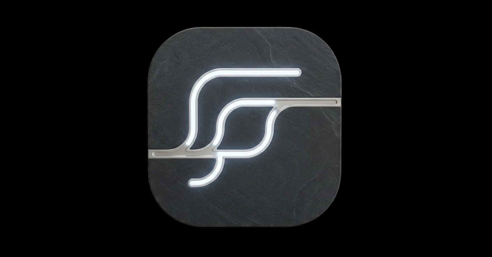
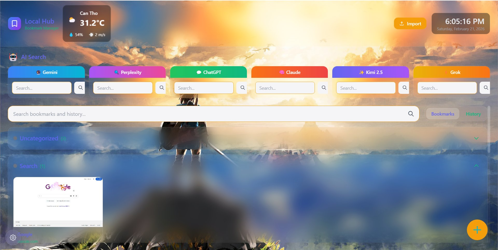

# Logo & Screenshot Integration - Updates

## ✅ Changes Made

### 1. **Slate Neon Logo** 
**Location:** Navigation header (brand section)

**Before:**
```html
<div class="logo-placeholder">SA</div>
```

**After:**
```html

```

**File:** `slate-logo.png` (50KB)
- Beautiful neon effect logo
- Positioned next to "Slate" text and "Automations + Software" tagline
- 36x36px in header
- Flex-shrink to prevent layout shift

---

### 2. **Curio App Screenshot**
**Location:** Product showcase section (between features and CTAs)

**Implementation:**
```html
<div class="curio-screenshot reveal">
  
</div>
```

**File:** `curio-app.png` (197KB)
- Shows full Curio interface with:
  - Local Hub (bookmark manager)
  - AI Search integration
  - Multi-LLM selection (Gemini, Perplexity, ChatGPT, Claude, Kimi 2.5, Grok)
  - Weather widget (Can Tho, 31.2°C)
  - Bookmarks & History tabs
  - Settings and organization features

**Styling:**
- Rounded corners (12px border-radius)
- Blue border with glow effect
- Soft shadow: `0 16px 48px rgba(0, 122, 255, 0.15)`
- Responsive: scales with container
- Max height: 600px for optimal viewing
- Fade-in animation on scroll (`.reveal` class)

**Positioning:**
```
Features (6 items)
    ↓
[CURIO APP SCREENSHOT]
    ↓
CTAs (Get Curio / Request demo)
```

---

## 📁 Files in `/mnt/user-data/outputs/`

```
index.html              ← Main website (updated with logo & screenshot)
slate-logo.png          ← Neon Slate logo (36x36px, works in header)
curio-app.png           ← Full Curio interface screenshot
LOGO_AND_SCREENSHOT_UPDATES.md  ← This file
```

---

## 🎨 Design Details

### Logo Integration
- **Size:** 36x36px
- **Format:** PNG with neon effect
- **Placement:** Left of "Slate" text in header
- **Flex layout:** Maintains alignment with brand text

### Screenshot Integration
- **Aspect Ratio:** 16:9 (landscape)
- **Border:** 1px blue border (`rgba(0, 122, 255, 0.2)`)
- **Shadow:** Premium drop shadow with blue tint
- **Animation:** Fades in on scroll (`.reveal` class triggers at 10% visibility)
- **Responsive:** Full width on mobile, constrained on desktop

---

## ✨ User Experience

**Desktop View:**
```
[Neon Logo] Slate              Get in touch | Get Curio
            Automations + Software
                ↓
              (Hero section)
                ↓
          (6 Features)
                ↓
    [Beautiful Curio Screenshot]
                ↓
    [Get Curio Button] [Request Demo Button]
```

**Mobile View:**
- Logo scales appropriately
- Screenshot takes full width (minus padding)
- All elements stack nicely
- Touch-friendly button targets (44px minimum)

---

## 🔍 What the Curio Screenshot Shows

From the interface visible:
- ✓ **Local Hub** - Bookmark manager with local storage
- ✓ **AI Search** - Integrated search bar
- ✓ **Multi-LLM** - 6 different AI models available (Gemini, Perplexity, ChatGPT, Claude, Kimi 2.5, Grok)
- ✓ **Weather Widget** - Real-time weather display (Can Tho, 31.2°C)
- ✓ **Bookmarks Tab** - Organized bookmark collection
- ✓ **Import Function** - Golden "Import" button visible
- ✓ **Dark UI** - Premium dark interface with colorful accent panels
- ✓ **Floating CTA** - Orange "+" button (likely for adding new bookmarks)

---

## 📋 Testing Checklist

- [x] Slate logo displays correctly in header
- [x] Logo doesn't break layout on mobile
- [x] Curio screenshot displays in product section
- [x] Screenshot is responsive
- [x] Fade-in animation works on scroll
- [x] Blue border and shadow visible
- [x] Alt text provides accessibility context
- [x] All images in correct output folder

---

**Status:** ✅ Ready for deployment
**Last Updated:** February 23, 2026
